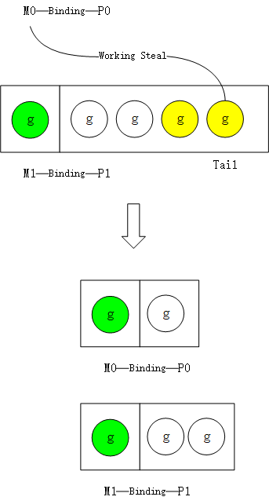

# Go Schedule

goroutine的高并发能力与其背后的调度器息息相关，这一章我们就来了解一下go的调度机制~同时，在本章的最后一节会介绍一个Go并发调优的大杀器go trace来帮助大家更好的学习go的调度！！！

## 1. 砖头，小车与Gopher -- go的调度模型

在山的那边海的那边有一群勤劳的Gopher，他们日以继夜的干一件事情----搬砖。


搬砖这件看似简单的事情背后到底隐藏的什么，为何会和go的调度模型扯上关联？不妨先来一发哲学三问。

搬的什么？-- 砖

谁在搬？ -- gopher

用什么搬的？-- 小推车

当大家机智的回答出这些问题的时候，恭喜你对go的调度模型已经有一个初步的认识了。假如这些砖是golang世界中的一个个goroutine，那么gopher搬砖的过程就是调度goroutine的过程，而砖，gopher和小车在go世界中的映射就是我们这一章节的三大主角，调度模型的核心。

调度的什么？--- g : 它就是大名顶顶的goroutine

谁在执行调度？--- m : 给我们打黑工的苦逼线程

用的什么调度？ --- p : 线程执行的goroutine队列

可以在`runtime/runtime2.go`中看到三大主角的原貌，在这里它们的核心内容可以简化为以下结构体：

```go
//g本质上是维护了一个协程栈
//被运行的g会和执行他的m关联上
type g struct {
	stack          stack   // offset known to runtime/cgo
    sched          gobuf   // 当发生调度时，保存现场，记录了当前运行的pc和sp
    atomicstatus   uint32  // 当前goroutine的状态
	m              *m      // current m; offset known to arm liblink
    //preempt是抢占标志位，m在执行g时会查看该标志位，以决定是否中断当前任务
	preempt        bool    // preemption signal, duplicates stackguard0 = stackpreempt
}

//m有自己线程栈（g0栈），当前运行的g，以及一个p（goroutine队列）
//m可以脱离p运行当m执行的不是go代码的时候
type m struct {
	g0            *g       // goroutine with scheduling stack
	procid        uint64   // for debuggers, but offset not hard-coded
	curg          *g       // current running goroutine
	p             puintptr // attached p for executing go code (nil if not executing go
	park          note
}

// p本质上是一个goroutine队--runq ，容量为256。
// 一个状态正常的p是需要与m绑定的
// 当前goroutine产生出来的子goroutine会被放在runnext中而非队尾
type p struct {
    m           muintptr   // back-link to associated m (nil if idle)
	// Queue of runnable goroutines. Accessed without lock.
	runqhead uint32
	runqtail uint32
	runq     [256]guintptr
	// runnext, if non-nil, is a runnable G that was ready'd by
	// the current G and should be run next instead of what's in
	// runq if there's time remaining in the running G's time
	// slice. It will inherit the time left in the current time
	// slice. If a set of goroutines is locked in a
	// communicate-and-wait pattern, this schedules that set as a
	// unit and eliminates the (potentially large) scheduling
	// latency that otherwise arises from adding the ready'd
	// goroutines to the end of the run queue.
	runnext guintptr
}
```

`runtime/proc.go--func schedule()`

那么go的调度体系需要解决那些问题呢？回到gopher的世界中，有了小车，gopher搬砖的效率得到了很大的提升，但是作为黑心老板的我们想要榨干gopher的劳动力，不停的大量制造砖扔到gopher的小车子里，第一个问题来了，小车的容量有限，如果制造砖的速度大于消耗砖的速度，小车将无法继续装入更多的砖块了。同样的，go的世界中的小车P只能容纳256个goroutine，那么超出限额的goroutine应该放在哪里呢？

为了解决这个问题，go引入了schedt结构，该结构时全局唯一也是全局可见的，它的作用主要为了存放关于调度的全局信息，比如，总共有多少个P，多少个空置的P，多少个M...有了这些信息才可以统筹规划调度，之后会详细介绍。除了这些，schedt结构中还维护了一个全局的goroutine队列，这个队列长度没有限制，当goroutine的数量超出P的容量时，M会将P中一半的goroutine放入全局队列。

```go
type schedt struct {
    //...
	// Global runnable queue.
	runqhead guintptr
	runqtail guintptr
	runqsize int32
    // 除了全局队列，schedt中也会存放关于调度的全局信息...
}
```

`runtime/proc.go--func findrunnable()`

聪明的gopher也找到了相似的解决方法，它们建了一个砖堆用来存放多余的砖块。gopher夜以继日幸苦劳作终于把车中的goroutine都执行完了，但是，它想起来还有一部分砖被自己扔在了砖堆中，于是它又跑去砖堆中拿goroutine，那么它应该拿多少块砖呢？gopher想到自己有3个小伙伴，它觉得应该和它的小伙伴们平分这一堆砖，于是它拿走了砖堆中四分之一的砖。在go的世界中M会根据机器的核数来平分全局队列中的goroutine，当然如果平分后的结果大于P的容量，那么它只会拿走P的容量个goroutine。`n := sched.runqsize/gomaxprocs + 1`.（n大于256则取256）。

为了防止全局队列中的goroutine“饿死”，在执行了61个本地队列的服务后，会从全局队列中获取一个服务。

终于有一天，gopher发现砖堆中的砖都也被拿完了，gopher感觉自己已经到达了人生的巅峰终于可以安度晚年的。这时，另一个gopher推着小车经过了它的身边，善良而又勤劳的gopher想，虽然自己已经可以功成身退了，但是自己的兄弟们还在水深火热的境地中搬砖，于是它又推起了小车，偷偷的将刚刚那个gopher车里一半的砖放到了自己车里...

对于go中的M来说，这个过程称作为working steal，其源码如下：

```go
// Steal half of elements from local runnable queue of p2
// and put onto local runnable queue of p.
// Returns one of the stolen elements (or nil if failed).
func runqsteal(_p_, p2 *p, stealRunNextG bool) *g {
	t := _p_.runqtail
	n := runqgrab(p2, &_p_.runq, t, stealRunNextG)
	if n == 0 {
		return nil
	}
	n--
	gp := _p_.runq[(t+n)%uint32(len(_p_.runq))].ptr()
	if n == 0 {
		return gp
	}
	h := atomic.Load(&_p_.runqhead) // load-acquire, synchronize with consumers
	if t-h+n >= uint32(len(_p_.runq)) {
		throw("runqsteal: runq overflow")
	}
	atomic.Store(&_p_.runqtail, t+n) // store-release, makes the item available for consumption
	return gp
}
```

m会从其他m的p的队尾偷取一半的goroutine，以避免锁操作。



终于有一天，该搬的砖搬完了，不该搬的砖也偷不到了，gopher可以去休息了么？不一定，它有可能把小车放一旁被任命为负责值班的gopher--`spining m`。什么情况下M会变`spining m`，它又要干些什么呢？

```go
	if !_g_.m.spinning && 2*atomic.Load(&sched.nmspinning) >= procs-atomic.Load(&sched.npidle) {
		goto stop
	}
	if !_g_.m.spinning {
		_g_.m.spinning = true
		atomic.Xadd(&sched.nmspinning, 1)
	}
```

当在运作的P数量（这个数量就被存在刚刚提到的schedt结构体中）大于`spinning m`数量两倍的时候，没事干的M就会被派去值班，简单的来讲，有两个还在干活的M就至少会有一个值班M，以此类推。M被任命为值班者后会再次确认是否有还在干活的小伙伴们，是否有epoll任务是否有gc任务，如果有上述任务，那么`spinning m`再次尝试working steal或者执行相关任务。

有些时候值班小哥发现自己去工作了就已经没有人值班了，这个时候它会唤醒一个已经休息的gopher成为新的值班者。

## 2. Gopher里的监工--Sysmon

砖，小车，gopher的模型似乎已经足够支持烧砖厂的日常运作了，直到有一天，gopher的小车中出现了一块特别难以烧制的砖，在烧这块砖的过程中它花了很多时间导致了大量的砖堆积在它的小车中得不到烧制。在go的世界中这件事时常发生，如果执行某个goroutine需要耗费大量的时间，那么会导致其他goroutine无法得到调度，所以我们需要一个监工的角色来查看是否有这种情况发生，在go的世界中这个监工就是Sysmon。

`runtime/proc.g---func sysmon()`

Sysmon主要干如下几件事情：

1. 查看是否有可以运行的网络任务
2. 处理长时间处于执行同一个任务的线程
3. 2分钟进行一次强制GC
4. 将线程申请来的5分钟没有用的span退还给操作系统

```mermaid
graph LR
A(sysmon)-->B(poll network)
B-->C(retakeP)
C-->D(force GC)
D-->E(free unused span)
```

`runtime/proc.g---func sysmon()`

跟调度关联紧密的是处理长时间被执行的goroutine的操作，该操作称为`retakep`。sysmon首先会查看当前执行goroutine的执行时常，当其超过了20us，就会触发retakep。sysmon首先会查看是由何原因导致了m长时间执行同一个任务。如果m长时间进入Syscall状态，那么当前goroutine无法被抢占，该M也没有能力继续执行P中的其他goroutine，所以sysmon会脱离M和P的绑定关系，同时唤醒或创建新的M和P绑定。


如果M并未进入Syscall，那么Sysmon置起当前goroutine的抢占标志位。当M发现当前G的抢占标志位被置起时，会将该G调度置全局队列中。


## 3. Go背后的故事

上一章讲到goroutine的用法，只需要`go func`即可，那么`go`关键字的背后是怎么将任务添加到调度队列中的呢？

首先编译器会识别出哪些地方进行了函数调用，当不加go关键字时，这次调用就是一次正常调用，加了go关键字，这次调用就成为了一次`callGo`，编译器会进行如下操作：

```go
	case k == callGo:
		call = s.newValue1A(ssa.OpStaticCall, types.TypeMem, newproc, s.mem())
```

简单来讲，callGo会导致此处调用newproc函数，`newproc = sysfunc("newproc")`。我们在`go/runtime/proc.go`中可以找到这个函数。

```go
func newproc(siz int32, fn *funcval) {
	argp := add(unsafe.Pointer(&fn), sys.PtrSize)
	gp := getg()  //这里拿到caller的goroutine
	pc := getcallerpc()
    //systemstack意味着里面的函数式通过线程栈（g0栈）来进行的
	systemstack(func() {
		newproc1(fn, (*uint8)(argp), siz, gp, pc) 
	})
}

func newproc1(fn *funcval, argp *uint8, narg int32, callergp *g, callerpc uintptr) {
    _g_ := getg() //这里又getg了，这个g就是g0
    //...忽略一些细节
    
    //这里需要注意一下函数参数表在go里面不能无限大的...
	// We could allocate a larger initial stack if necessary.
	// Not worth it: this is almost always an error.
	// 4*sizeof(uintreg): extra space added below
	// sizeof(uintreg): caller's LR (arm) or return address (x86, in gostartcall).
	if siz >= _StackMin-4*sys.RegSize-sys.RegSize {
		throw("newproc: function arguments too large for new goroutine")
	}
    
    //这里拿到了m的小车
	_p_ := _g_.m.p.ptr()
    //之前执行完的g会暂时放到_p_.gFree中，所以先尝试从gFree中获得新g
	newg := gfget(_p_)
    //没拿到g的话那么会创建一个g
	if newg == nil {
		newg = malg(_StackMin)
		casgstatus(newg, _Gidle, _Gdead)
		allgadd(newg) // publishes with a g->status of Gdead so GC scanner doesn't look at uninitialized stack.
    }

    //忽略一些newg初始化的细节。这里开始它就是一个runnable的g了
	casgstatus(newg, _Gdead, _Grunnable)

    //...
    
    //将g放入任务队列中
	runqput(_p_, newg, true)

    //当启动一个g时，会查看是否有idle状态的p,如果有的话且此时没有spinning m,就会唤醒一个spinning m
	if atomic.Load(&sched.npidle) != 0 && atomic.Load(&sched.nmspinning) == 0 && mainStarted {
		wakep()
	}
    
    //...
}
```

比较有意思的是runqput的设计:

```go
func runqput(_p_ *p, gp *g, next bool) {
    //创建的goroutine会有一半的几率被放入_p_.runnext
	if randomizeScheduler && next && fastrand()%2 == 0 {
		next = false
	}

    //如果被放入runnext，则与oldnext互换身份
	if next {
	retryNext:
		oldnext := _p_.runnext
		if !_p_.runnext.cas(oldnext, guintptr(unsafe.Pointer(gp))) {
			goto retryNext
		}
		if oldnext == 0 {
			return
		}
		// Kick the old runnext out to the regular run queue.
		gp = oldnext.ptr()
	}

retry:
    //尝试将任务放入m的本地队列的队尾
	h := atomic.Load(&_p_.runqhead) // load-acquire, synchronize with consumers
	t := _p_.runqtail
	if t-h < uint32(len(_p_.runq)) {
		_p_.runq[t%uint32(len(_p_.runq))].set(gp)
		atomic.Store(&_p_.runqtail, t+1) // store-release, makes the item available for consumption
		return
	}
    //本地队列被放满时，放入全局队列。
	if runqputslow(_p_, gp, h, t) {
		return
	}
	// the queue is not full, now the put above must succeed
	goto retry
}	
```


## 4. 上帝说要有光 -- main goroutine

在讲go调度模型之前，我们不访先来思考一个问题，go的程序是如何开始的？

接下来我们一层层的拨开披在main.main外面的外衣，看看它们分别做了什么。

以amd64系统为例，在go源码的runtime包中，找到asm_amd64.s这个文件，该文件中的main函数是所有go程序的入口，它的内容是调用runtime.rt0_go。

```assembly
TEXT main(SB),NOSPLIT,$-8
	JMP	runtime·rt0_go(SB)
```

runtime.rt0_go这个函数的内容就十分丰富了，我们忽略一些细节操作。看看它的主要功能有哪些。

```assembly
TEXT runtime·rt0_go(SB),NOSPLIT,$0
	//...
	
	// 初始化了g0
	// create istack out of the given (operating system) stack.
	// _cgo_init may update stackguard.
	MOVQ	$runtime·g0(SB), DI
	LEAQ	(-64*1024+104)(SP), BX
	MOVQ	BX, g_stackguard0(DI)
	MOVQ	BX, g_stackguard1(DI)
	MOVQ	BX, (g_stack+stack_lo)(DI)
	MOVQ	SP, (g_stack+stack_hi)(DI)

    // 根据cpu和系统信息做相应的初始化操作
    //...

ok:
    // 将g0和m0关联
	// set the per-goroutine and per-mach "registers"
	get_tls(BX)
	LEAQ	runtime·g0(SB), CX
	MOVQ	CX, g(BX)
	LEAQ	runtime·m0(SB), AX

	// save m->g0 = g0
	MOVQ	CX, m_g0(AX)
	// save m0 to g0->m
	MOVQ	AX, g_m(CX)
	
	//...
	//初始化操作
	CALL	runtime·args(SB)
	CALL	runtime·osinit(SB)
	CALL	runtime·schedinit(SB)

    // 看了这么久终于看到入口了，runtime.main进来了!!!
	// create a new goroutine to start program
	MOVQ	$runtime·mainPC(SB), AX		// entry
	PUSHQ	AX
	PUSHQ	$0			// arg size
	CALL	runtime·newproc(SB)
	POPQ	AX
	POPQ	AX

	// 调用mstart
	CALL	runtime·mstart(SB)

	CALL	runtime·abort(SB)	// mstart should never return
	RET
```

我们理一理rt0_go干的事情：

```mermaid
graph LR
A(初始化g0)-->B(关联g0和m0)
B-->C(各种init)
C-->D(调用newproc)
D-->调用mstart

```

回忆以下上一节，其中有一个线程栈（g0）的概念，线程栈即使在rt0_go中被初始化的。有了线程栈之后，线程利用线程栈执行newproc启动main goroutine。newproc的细节在我们已经在上一章中熟悉了，这里也不再赘述，重点将目光聚焦在newproc接收的func上。通过分析汇编代码，我们发现runtime.mainPC传入了newproc，函数位于`runtime/proc.go--func main`。

runtime.main的流程如下：

```mermaid
graph LR
runtime.main-->A(start sysmon)
A-->B(runtime.init)
B-->C(main.init)
C-->D(main.main)
```

除了上述流程，在runtime.main中还定义了协程栈的可扩容致的最大值：

```go
	if sys.PtrSize == 8 {
		maxstacksize = 1000000000
	} else {
		maxstacksize = 250000000
	}
```


## 5. Go程序的摄像机 -- go trace

在调度的每个关键步骤旁都有一段代码在边上默默记录下发生的一切，就彷佛一台摄像机在观察着调度发生的一切，每一个goroutine的生老病死都在它的观测之下，这段代码所提供的服务就是go trace。当然为了使go trace运作，我们需要在代码中插入一些使能代码，告诉runtime中的trace代码摄像机被打开了，你们需要工作了。

